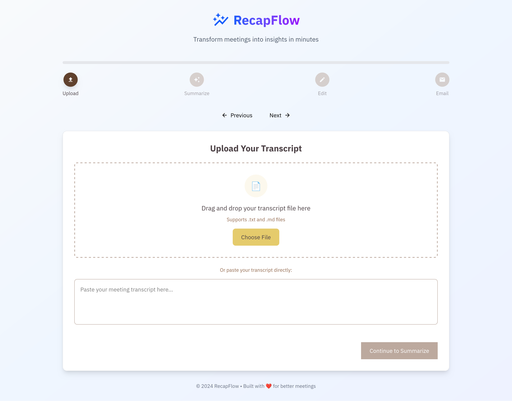

# RecapFlow

🔄 **AI-powered transcript summarization and sharing platform**

---

## 🚀 Quick Links

- [Live Website](https://recapflow.ashwithrai.me)
- [YouTube Tutorial](https://youtu.be/MGnnq_zM0Mw?si=qsmpoGoi6IJRjkqG)

---



## Overview

RecapFlow is a full-stack application that helps users upload meeting transcripts, generate AI-powered summaries with custom prompts, and share them via email. Built with Next.js frontend, FastAPI backend, and powered by LangChain + Gemini AI.


## 🏗️ Project Structure

```
RecapFlow/
├── frontend/              # Next.js + Tailwind CSS
│   ├── src/
│   │   ├── app/           # Next.js app directory (pages, layouts)
│   │   ├── components/    # Reusable UI components
│   │   ├── config/        # Environment configuration
│   │   ├── utils/         # Utility functions
│   ├── public/            # Static assets (logo, favicon, etc.)
│   ├── .env.example       # Frontend environment template
│   ├── .env               # Frontend environment variables (git-ignored)
│   ├── package.json
│   ├── tailwind.config.js
│   └── postcss.config.js
├── backend/               # FastAPI + Python
│   ├── main.py           # FastAPI app entrypoint
│   ├── routes.py         # API route definitions
│   ├── ai.py             # Handles Gemini AI calls
│   ├── emailer.py        # Email service wrapper
│   ├── .env.example      # Backend environment template
│   ├── .env              # Backend environment variables (git-ignored)
│   └── requirements.txt
├── .gitignore
└── README.md
```

## 🚀 Quick Start

### Backend Setup

1. **Create virtual environment:**
   ```bash
   cd backend
   python -m venv .venv
   source .venv/bin/activate  # On Windows: .venv\Scripts\activate
   ```

2. **Install dependencies:**
   ```bash
   pip install -r requirements.txt
   ```

3. **Configure environment:**
   ```bash
   cp .env.example .env
   # Edit .env with your API keys and credentials
   ```

4. **Run the server:**
   ```bash
   uvicorn main:app --reload
   ```

### Frontend Setup (Next.js)

1. **Install dependencies:**
   ```bash
   cd frontend
   npm install
   ```

2. **Configure environment:**
   ```bash
   cp .env.example .env
   # Edit .env with your frontend configuration (API URL, etc.)
   ```

3. **Start development server:**
   ```bash
   npm run dev
   ```
## 🔧 Environment Variables

### Backend Configuration

Copy `backend/.env.example` to `backend/.env` and fill in your credentials:

- `GOOGLE_API_KEY` - Your Gemini API key
- `EMAIL_ADDRESS` - Gmail account for sending summaries
- `EMAIL_PASSWORD` - App password for Gmail SMTP
- `API_HOST` - Backend server host (default: 0.0.0.0)
- `API_PORT` - Backend server port (default: 8000)
- `FRONTEND_URL` - Frontend URL for CORS (default: http://localhost:5173)


### Frontend Configuration

Copy `frontend/.env.example` to `frontend/.env` and configure:

- `NEXT_PUBLIC_API_BASE_URL` - Backend API URL (default: http://localhost:8000)
- `NEXT_PUBLIC_APP_NAME` - Application name (default: RecapFlow)
- `NEXT_PUBLIC_APP_VERSION` - Application version
- `NODE_ENV` - Environment mode (development/production)

## 🛠️ Tech Stack


**Frontend:**
- Next.js 15 (App Router)
- React 18 with Hooks and Context
- Tailwind CSS for responsive styling
- React Icons for consistent iconography
- React Hot Toast for notifications
- Modular component architecture
- Environment-based configuration

**Backend:**
- FastAPI for high-performance API
- Google Gemini AI API for summarization
- Python SMTP for email delivery
- CORS middleware for cross-origin requests
- Structured logging and error handling
- Environment-based configuration


**Development:**
- Hot reloading (Next.js + FastAPI)
- Environment-based configuration
- Modular AI workflows

## 📦 API Endpoints

- `GET /` - API welcome message
- `GET /health` - Service status and connection tests
- `POST /upload` - Upload transcript files (.txt, .md, .docx)
- `POST /summarize` - Generate AI summary from transcript
- `POST /send-email` - Send summary via email to recipients

## ✨ Features

- **📁 File Upload**: Support for .txt, .md, and .docx files
- **🤖 AI Summarization**: Powered by Google Gemini AI
- **✏️ Custom Prompts**: Personalize AI output with custom instructions
- **📝 Summary Editing**: Live editing with markdown support
- **📧 Email Sharing**: Send summaries with professional formatting
- **👤 Sender Details**: Customizable email signatures with localStorage
- **🔄 Step-by-Step Wizard**: Intuitive 4-step process
- **📱 Responsive Design**: Works on desktop, tablet, and mobile
- **🎨 Modern UI**: Beautiful interface with icons and animations
- **🍞 Toast Notifications**: Real-time feedback for all operations
- **💾 Local Storage**: Automatic saving of preferences and data

## 🤝 Contributing

This is a development project. Follow the development order outlined in the roadmap for systematic implementation.

---


**Current Status:** ✅ **Production Ready** - Full-featured application with comprehensive UI/UX

---

## 📺 Demo & Tutorial

- [Watch the YouTube Tutorial](https://youtu.be/MGnnq_zM0Mw?si=qsmpoGoi6IJRjkqG)
- [Try the Live Website](https://recapflow.vercel.app)